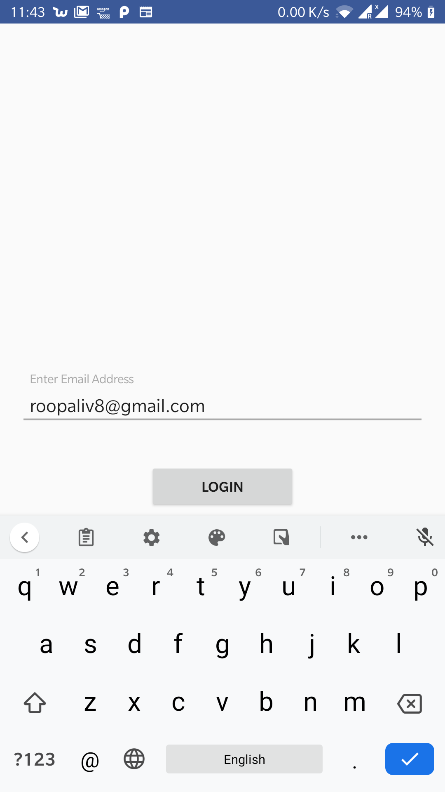
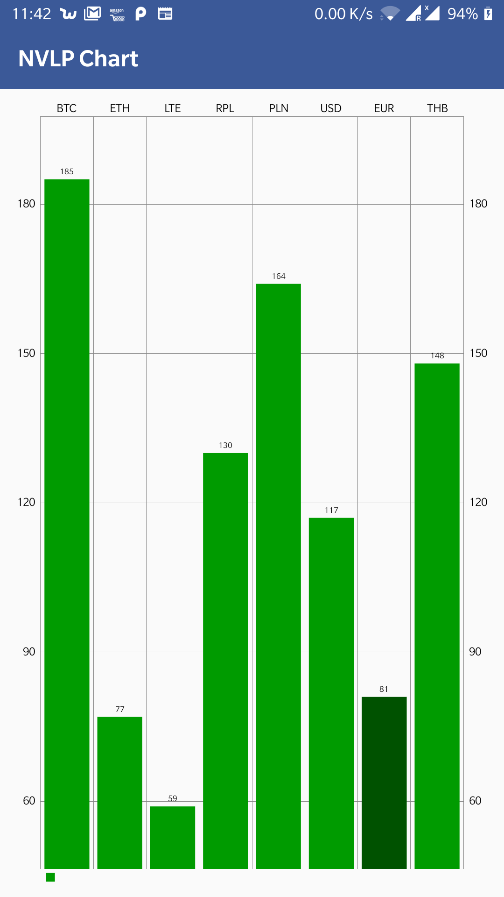

## this application is following MVP pattern and it has SSE connection along with bar chart representation for real time crypto prices

## steps to launch application in android studio
1.Import the application in android studio from git.
2.It will download gradle dependency and create build to execute.

## Screenshots

